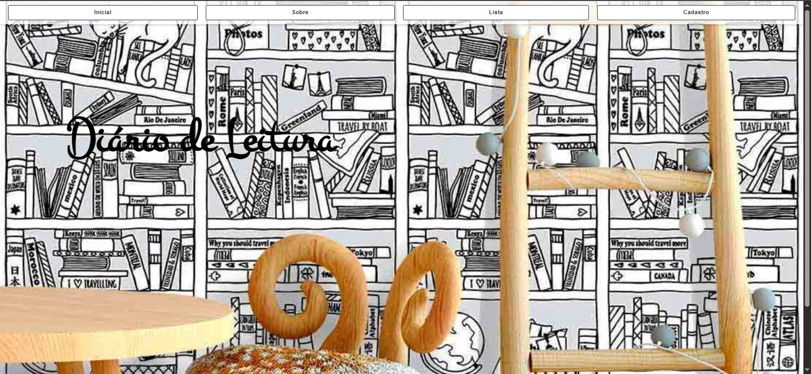
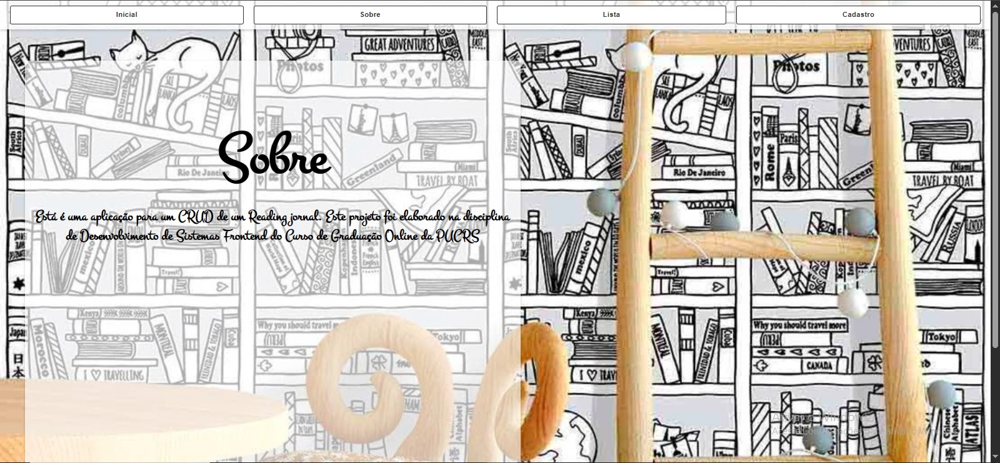
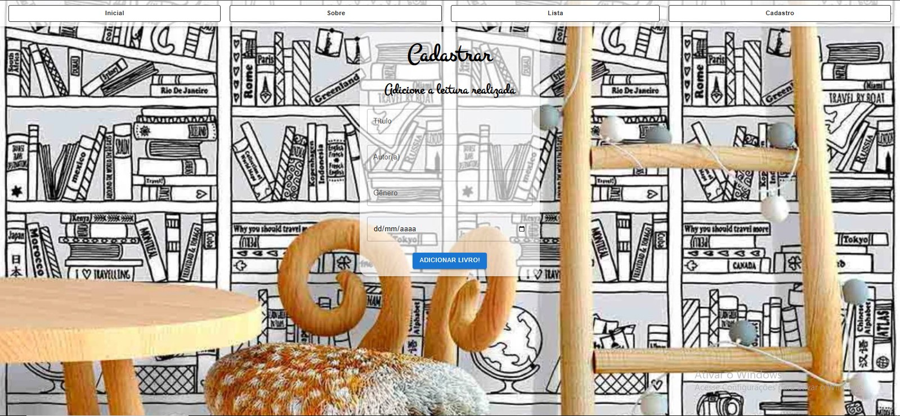

# Aplicação Reading Journal

## Nome: `Peterson Weschenfelder do Amaral`

## Introdução

O **Reading Journal** é uma aplicação web desenvolvida como parte da disciplina de **Desenvolvimento de Sistemas Frontend** do curso de Graduação Online da PUCRS. Este projeto tem como objetivo implementar um sistema CRUD (Create, Read, Update, Delete) para gerenciar um diário de leitura, permitindo que os usuários cadastrem, visualizem, editem e excluam livros.

A aplicação utiliza as seguintes tecnologias:
- **React.js**: Para a construção da interface de usuário.
- **React Router**: Para a navegação entre as páginas.
- **JavaScript (ES6+)**: Para a lógica de programação.
- **Material-UI**: Para estilização e componentes visuais.
- **HTML5 e CSS3**: Para a estrutura e estilização.

---

## Funcionalidades

- **Cadastro de Livros**: Permite adicionar informações como título, autor, gênero e data de leitura.
- **Lista de Livros**: Exibe todos os livros cadastrados.
- **Edição de Livros**: Permite editar as informações de um livro já cadastrado.
- **Exclusão de Livros**: Permite remover livros da lista.
- **Navegação**: Interface amigável com links para diferentes páginas (Página Inicial, Sobre, Lista de Livros e Cadastro de Livros).

---

## Estrutura do Projeto

A estrutura do projeto é organizada da seguinte forma:

```
src/
|── App.js
├── App.module.css
├── index.css
├── index.js
├── reportWebVitals.js
└── Components/
    ├── BookForm/
    │   └── BookForm.js
    ├── BookList/
    │   ├── Book.js
    │   └── BookList.js
    └── NavBar/
        └── NavBar.js
```

---

## Componentes

Os componentes estão localizados no diretório `./src/Components` e possuem as seguintes características:

### BookForm
- **Props**:
  - `onAddBook`: Callback para adicionar um novo livro à lista.
- **Descrição**: Este componente permite que o usuário cadastre um novo livro, preenchendo informações como título, autor, gênero e data de leitura. Ele valida os campos antes de enviar os dados.
- **Exemplo de uso**:
  ```jsx
  <BookForm onAddBook={addBook} />
  ```

### BookList
- **Props**:
  - `books`: Array de livros cadastrados.
  - `onDeleteBook`: Callback para excluir um livro da lista.
  - `onEditBook`: Callback para editar as informações de um livro.
- **Descrição**: Este componente exibe a lista de livros cadastrados. Ele permite que o usuário edite ou exclua livros.
- **Exemplo de uso**:
  ```jsx
  <BookList books={books} onDeleteBook={deleteBook} onEditBook={editBook} />
  ```

### Book
- **Props**:
  - `book`: Objeto com as informações do livro.
  - `onDelete`: Callback para excluir o livro.
  - `onEdit`: Callback para editar o livro.
- **Descrição**: Este componente representa um único livro na lista. Ele permite que o usuário visualize, edite ou exclua o livro.
- **Exemplo de uso**:
  ```jsx
  <Book book={book} onDelete={handleDelete} onEdit={handleEdit} />
  ```

### NavBar
- **Descrição**: Este componente exibe uma barra de navegação com links para as páginas principais da aplicação.
- **Exemplo de uso**:
  ```jsx
  <NavBar Links={Links} />
  ```

---

## Como Executar a Aplicação

1. Certifique-se de ter o **Node.js** instalado em sua máquina.
2. Clone este repositório:
   ```bash
   git clone https://github.com/seu-usuario/seu-repositorio.git
   ```
3. Navegue até o diretório do projeto:
   ```bash
   cd peterson-weschenfelder-do-amaral-fase-1-desenvolvimento-frontend
   ```
4. Instale as dependências:
   ```bash
   npm install
   ```
5. Inicie o servidor de desenvolvimento:
   ```bash
   npm start
   ```
6. Acesse a aplicação no navegador em [http://localhost:3000](http://localhost:3000).

---

## Resultado Esperado

Após executar o projeto, este é o resultado esperado no navegador:

- Página Inicial:
  

- Página Sobre:
  

- Lista de Livros:
  

- Cadastro de Livros:
  

---

## Melhorias Futuras

- Implementar autenticação de usuários.
- Adicionar funcionalidade de busca e filtro na lista de livros.
- Melhorar o design da interface com bibliotecas como Material-UI ou Tailwind CSS.
- Criar testes unitários para os componentes principais.

---

## Sobre o Autor

Este projeto foi desenvolvido por **Peterson Weschenfelder do Amaral**, estudante de **Análise e Desenvolvimento de Sistemas** na PUCRS. Com interesse em desenvolvimento frontend, busco aplicar os conceitos aprendidos em aula para criar aplicações funcionais e intuitivas.

---

## Licença

Este projeto é apenas para fins demonstrativos e não contém mais alterações do que as necessárias para demonstrar algumas funcionalidades úteis para o desenvolvimento de projetos em ReactJS.